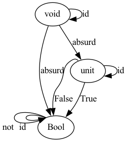

# Category Theory for Programmers Challenges

I will chose Haskell as my favorite programming language. TypeScript will be my second favorite.

## 1. Category: The Essence of Composition

1.  In TypeScript:

```
const id = x => x
```

2.  In TypeScript:

```
function compose<A, B, C>(f: (a: B) => C, g: (a: A) => B):  (a: A) => C {
  return (a: A) => f(g(a));
}
```

3. In TypeScript we can proof that compose is both associate and respects identity using the type system. If this program compiles it proofs the function compose respects both laws:

```
function numberToString(a: number): string { return a + ""; }

function stringToNumber(a: string): number { return parseFloat(a); }

// to check that the type of x1 equals the type of x2
function isAssociative<X>(x1: X, x2: X) {}; 

function proofCompose() { 
  const idL: typeof numberToString = compose(identity, numberToString);
  const idR: typeof numberToString = compose(numberToString, identity);
  isAssociative(
    compose(numberToString, compose(stringToNumber ,numberToString)), 
    compose(compose(numberToString, stringToNumber), numberToString)
  );
}
```

4. Yes. Pages are objects. Morphisms are links.

5. Yes.

6. When it allows loop edges.

## 2. Types and Functions

1. In TypeScript:

```
function memoize<A extends string | number, B>(fn: (a: A) => B): (a: A) => B {
  let mem: { [a: string | number]: B} = {};
  return a => {
    const cachedA = mem[a];
    if (cachedA) {
      return cachedA;
    } else {
      const b = fn(a);
      mem[a] = b;
      return b;
    }
  }
}
```

2. Yes, it works. In TypeScript:

```
const memoizedParsedInt = memoize(parseInt);
memoizedParsedInt("42");
memoizedParsedInt("42");
```

3. JavaScript does not have seeding. It would like look like this (and it would work):

```
const rnd = memoize(randomWithSeed(123));
```

4. 
 1. Yes.
 2. No. Getting values from stdin is a side-effect. 
 3. No. Printing to stdout is a side-effect.
 4. No. The static variable is mutated.

5. `2 ^ 2 = 4` functions:

True -> True
True -> False
False -> True
False -> False

6.  This challenge is a bit vague, because there can exist a function between each of these types, but not all of them make sense.

```
digraph G {
  void -> void [label="id"]
  void -> Bool [label="absurd"]
  void -> unit [label="absurd"]

  unit -> unit [label="id"]
  unit -> Bool [label="True"]
  unit:nw -> Bool [label="False"]
  
  Bool:nw -> Bool:nw [label="id"]
  Bool:nw -> Bool:nw [label="not"]  
}
```

