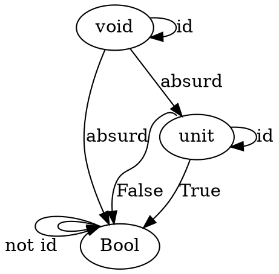
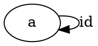
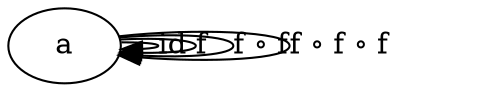
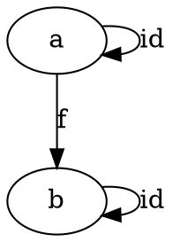
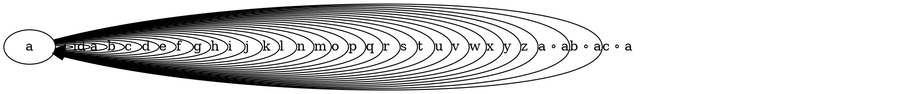

# Category Theory for Programmers Challenges

I will chose Haskell as my favorite programming language. TypeScript will be my second favorite.

## 1. Category: The Essence of Composition

### Summary

 * Categories consist out of arrows/morphisms and objects.
 * Categories have two laws:
   * Arrows should compose
   * There is an identity arrow from each object to itself.

### Exercises

1.1.  In TypeScript:

```typescript
function id(x: X) {
  return x;
}
```

1.2.  In TypeScript:

```typescript
function compose<A, B, C>(f: (a: B) => C, g: (a: A) => B):  (a: A) => C {
  return (a: A) => f(g(a));
}
```

1.3. In TypeScript we can proof that compose is both associate and respects identity using the type system. If this program compiles it proofs the function compose respects both laws:

```typescript
function numberToString(a: number): string { return a + ""; }

function stringToNumber(a: string): number { return parseFloat(a); }

// to check that the type of x1 equals the type of x2
function isAssociative<X>(x1: X, x2: X) {}; 

function proofCompose() { 
  const idL: typeof numberToString = compose(identity, numberToString);
  const idR: typeof numberToString = compose(numberToString, identity);
  isAssociative(
    compose(numberToString, compose(stringToNumber ,numberToString)), 
    compose(compose(numberToString, stringToNumber), numberToString)
  );
}
```

1.4. Yes. Pages are objects. Morphisms are links.

1.5. Yes.

1.6. When it allows loop edges *and* when for any two edges between three distinct nodes there is a third edge that points from the source of the first node to the target of the third. 

## 2. Types and Functions

### Summary
 
 * Types are like sets of values and therefore a mapping between the category of types can be made to the category Set. E.g. the object `Bool` in the category of types  is isomorphic to a set of two items in the category of `Set`.
 * The cateogory of haskell types (`Hask`) is like `Set` except it has a bottom type, because not all functions are guaranteed to return within finite time. 
 * Functions that may return the bottom type are partial functions, because they do not map every element of the domain to some element of the codomain.
 * Denotational semantics in combination with category theory made it possible for functional programming to easily describe real-world computation (not just mathematical functions) in a mathematically sound fashion. 
 *  Pure functions always produce the same input for the same ouput and do not change anything (side-effects). In Haskell all functions are pure.
 * `Void` is a Haskell type that has no instances and is therefore only used to proof impossibility.
 * `Unit` is a type that has only 1 value: `()`, the unit value.  

### Exercises

2.1. In TypeScript:

```typescript
function memoize<A extends string | number, B>(fn: (a: A) => B): (a: A) => B {
  let mem: { [a: string | number]: B} = {};
  return a => {
    const cachedA = mem[a];
    if (cachedA) {
      return cachedA;
    } else {
      const b = fn(a);
      mem[a] = b;
      return b;
    }
  }
}
```

2.2. Yes, it works. In TypeScript:

```typescript
const memoizedParsedInt = memoize((x: number) => {
  console.log("parseInt called");
  return parseInt(x);
});
memoizedParsedInt("42");
memoizedParsedInt("42");
```

will output `42` twice, but only print `parseInt called` once.

2.3. JavaScript does not have seeding. It would like look like this (and it would work):

```typescript
const rnd = memoize(randomWithSeed(123));
```

2.4.  
```
4.1 Yes.
4.2 No. Getting values from stdin is a side-effect. 
4.3 No. Printing to stdout is a side-effect.
4.4 No. The static variable is mutated.
```

2.5. `2 ^ 2 = 4` functions:

```
True -> True
True -> False
False -> True
False -> False
```

2.6.  This challenge is a bit vague, because there can exist a function between each of these types, but not all of them make sense.



## 3. Categories Great and Small

### Summary

 * On order:
   * A preorder is a category whose morphisms check that objects are less than or equal to each other (i.e. `<=`). From other sources we learned that a pre-order is a binary relation that is more general the equavalence relation. Whereas equavalence is reflexive, symmetric and transitive, a pre-order is only reflexive and transitive. This effectively means that pre-orders can have cycles.
   * A partial order adds the constraint that if `a <= b` and `b <= a` then `a` must be the same as `b`, i.e. anti-symmetry. This means there can be no cycles. For example the binary relation defined by this set {(a,a), (a, b), (b, b) (b, c), (c, c), (c, a)} is a pre-order, but not a partial order.
   * A linear or total order says that any two objects must be ordered, i.e. `a <= b` OR `b <= a` (also called strongly connected).
   * These orders can be represented as thin categories (categories where each morphism has at most one morphism between two objects). Pre-orders can have cycles, partial orders can not. 
 * On monoids:
   * A monoid is a binary relation with a unit.
   * A monoidal category contains one object with morphisms for each combination of `mappend`.


### Exercises

3.1.1. Add an identity arrow.



3.1.2. Add an identity arrow and infinite arrows for the composition of `f` with `f` and the composition of `f ∘ f` with `f`,  etc, where `f` is the arrow that connects the node with itself.



3.1.3. Add identity arrows.



3.1.4. Add an identity arrow and infinite composition of every letter with every other letter and with every composition of every letter, etc.



3.2. Q: What kind of order is this?

3.2.1.  Q: A set of sets with the inclusion relation: A is included in B if every element of A is also an element of B.

A relation $aRb$ is an inclusion relation when $a,b \in X: a \subseteq b$

This is a partial-order because the relation is:

 * ✅ Reflexive: $\forall x\in X:x\subseteq x$
 * ✅ Transitive: $\forall a,b,c\in X:\ ( a\ \subseteq b\ \land b\ \subseteq c) \ \rightarrow a\ \subseteq c$
 * ✅ Anti-symmetric: $\forall a,b \in X:a \subseteq b \land b \subseteq a \rightarrow{} a = b$ 

It is not a total order because not all contained sets have a inclusion relation with the other sets, which means it is not strongly connected.

3.2.2. Q: C++ types with the following subtyping relation: T1 is a subtype of T2 if a pointer T1 can be passed to a function that expects a pointer to T2 without triggering a compilation error.


In C++ this would look like this
```
void f(*T2 x) { ... }
T1 *y = ...;
f(y); // no compilation error
```

The sub-type relation `R` in C++ for a type `T1` and `T2` looks like this: 

```
R = { (T1, T1), (T1, T2), (T2, T2) }
```

This is reflexive, transitive and anti-symmetric. Therefore this is also a partial-order. Non-coincidentally this is very similar to the subset relation of the last question, because a sub-type is defined by having all the members of the type it inherits from.

It is not a total order because not every type is in some kind of sub-type or reverse sub-type relation with any other type.

3.3 Q: Considering that Bool is a set of two values True and False, show that it forms two (set-theoretical) monoids with respect to, respectively, operator && (AND) and || (OR).

The monoid `(Bool, &&, True)` and the monoid `(Bool, ||, False)` are both associative as well have an identity (`True` and `False`) respectively.

 * ✅ Associative: `(x && y) && z = x && (y && z)` / `(x || y) || z = x || (y || z)`
 * ✅ Identity: `x && True = x`  / `x || False = x`

3.4 Q: Represent the Bool monoid with the AND operator as a category: List the morphisms and their rules of composition.
 
Object:
 * `Bool` (the set of booleans: `{ False, True }`)
 
Morphisms:
 * `Identity = (&& True)`
 * `(&& False)`
 * `Identity . (&& False) = (&& False)`
 * `(&& False) . Identity = (&& False)`
 * `(&& False) . (&& False) = (&& False)`
 * Ad infinitum, the set of morphisms is closed under composition

Diagram:
 ```graphviz
digraph G {
  Bool:n -> Bool:n[label="(&& True)"]
  Bool:s -> Bool:s [label="(&& False)"]
}
```

3.5. Q: Represent addition modulo 3 as a monoid category.

Object:
 * `[0, 3)` (all numbers from 0 up to, but not including, 3)
 
Morphisms:
 * `Identity = (+ 3)`
 * `(+ 1)`
 * `(+ 2)`
 * `(+ 1) . (+ 2) = Identity`
 * `(+ 1) . (+ 1) = (+ 2)`
 * Ad infinitum, the set of morphisms is closed under composition

Diagram:
 ```graphviz
digraph G {
  "[0, 3)":n-> "[0, 3)":n [label="(+ 3)"]
  "[0, 3)"-> "[0, 3)" [label="(+ 1)"]
  "[0, 3)":s-> "[0, 3)":s [label="(+ 2)"]
}


The object of the category is `[0, Int < 3]`. The identity of the monoid is `0`. 